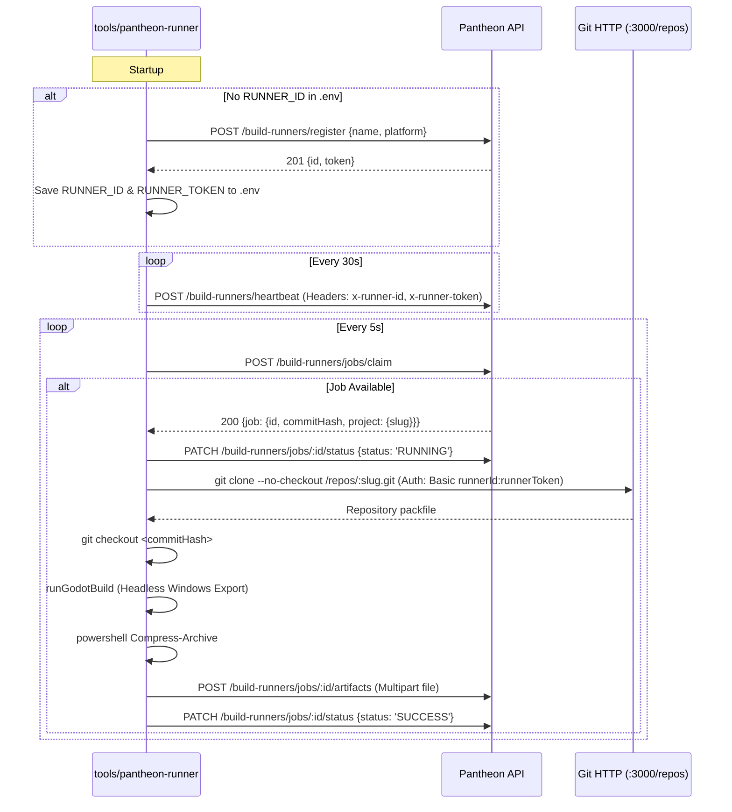

# Pantheon Build Runner Security Audit

**Document Version:** 1.0.0  
**Audit Target:** Pantheon Build Runner Architecture & Artifact Pipeline  
**Date:** September 28, 2026  
**Status:** Audit Complete — No Code Modified  

---

## 1. Scope

This audit evaluates the complete security posture of the build runner subsystem, artifact packaging pipeline, and related Git transport mechanisms in the Pantheon codebase. 

The audit covers:
1. **Runner Registration:** `POST /build-runners/register` and runner credential generation.
2. **Runner Authentication & Identity:** `BuildRunnerAuthGuard`, header handling, token hashing, and `GitBasicAuthGuard`.
3. **Job Claiming & Scheduling:** `POST /build-runners/jobs/claim` and multi-tenant job isolation.
4. **Heartbeat & Status Management:** `POST /build-runners/heartbeat` and `PATCH /build-runners/jobs/:jobId/status`.
5. **Artifact Upload Pipeline:** `POST /build-runners/jobs/:jobId/artifacts`, Multer upload handling, memory buffering, file system writes, and database recording.
6. **Artifact Exposure & Serving:** Express static file hosting in `main.ts`, file naming conventions, and PlayableBuild URLs.
7. **Runner Daemon Client:** `tools/pantheon-runner/index.js`, `godot-build-strategy.js`, environment variables, and daemon authentication.
8. **Data Models & Ownership:** Prisma schema definitions for `BuildRunner`, `BuildJob`, and `PlayableBuild`.
9. **Test Suite Coverage:** Unit and integration test coverage for runner security.

---

## 2. Current Architecture

Pantheon uses an external polling worker architecture for building native game executables (such as Godot Windows Desktop binaries):

```
┌────────────────────────┐         Claim Job (Poll 5s)        ┌────────────────────────┐
│                        │◄───────────────────────────────────│                        │
│                        │       Heartbeat (Every 30s)        │                        │
│                        │◄───────────────────────────────────│                        │
│     Pantheon API       │         Git Clone (Over HTTP)      │    Pantheon Runner     │
│   (NestJS / Express)   │◄───────────────────────────────────│        (Daemon)        │
│                        │      Upload Artifact (Multipart)   │                        │
│                        │◄───────────────────────────────────│                        │
└───────────┬────────────┘                                    └────────────────────────┘
            │
            ├──────► Local Disk: /uploads/build_<jobId>.zip
            │
            └──────► Static Middleware: app.use('/uploads', express.static(...))
                           ▲
                           │ Direct Public GET (No Auth)
                           │
                 [External Client / Attacker]
```

### Component Breakdown
1. **Backend API (`apps/api/src/build-runners`)**: Handles runner registration, heartbeat, job allocation, status updates, and artifact ingestion.
2. **Git HTTP Transport (`apps/api/src/git-http`)**: Implements Git Smart HTTP protocol (`info/refs`, `git-upload-pack`) over Basic Auth.
3. **Builds Service (`apps/api/src/builds`)**: Manages `BuildJob` state transitions and `PlayableBuild` records for projects.
4. **Static Host (`apps/api/src/main.ts`)**: Statically serves the root `./uploads` directory over Express without authentication.
5. **Local Runner Daemon (`tools/pantheon-runner`)**: Node.js CLI daemon running on a build machine; polls for jobs, fetches source, triggers local engine compiler, packages ZIP, and posts artifacts.

---

## 3. Runner Registration

### Endpoint & Implementation Details
- **Endpoint:** `POST /build-runners/register`
- **File:** [`apps/api/src/build-runners/build-runners.controller.ts:37-40`](file:///d:/Projects/Pantheon/apps/api/src/build-runners/build-runners.controller.ts#L37-L40)
- **Service:** [`BuildRunnersService.registerRunner`](file:///d:/Projects/Pantheon/apps/api/src/build-runners/build-runners.service.ts#L21-L43)
- **DTO:** [`RegisterRunnerDto`](file:///d:/Projects/Pantheon/apps/api/src/build-runners/dto/register-runner.dto.ts#L5-L14) (`name: string`, `platform: BuildPlatform`)

### Security Evaluation

| Requirement | Current State | Code Verification |
|---|---|---|
| **Registration Guard** | **None** | `build-runners.controller.ts:37-40` has no `@UseGuards(...)` decorator. |
| **Authentication Required** | **No** | Completely anonymous access. |
| **Registration Secret / API Key** | **None** | Caller only sends `name` and `platform`. |
| **Tenant / Project Scoping** | **None** | Runner record does not store `projectId`, `userId`, or `organizationId`. |
| **Stored Information** | `id` (UUID), `name`, `platform`, `tokenHash`, `isOnline: true`, `lastSeenAt: Date` | `build-runners.service.ts:26-34` |
| **Credential Generation** | 32-byte hex random string, hashed via `bcrypt.hash(token, 10)` | Plain token returned once in HTTP response. |

### Finding: Unauthenticated Global Runner Registration
- **Status:** **CONFIRMED**
- **Severity:** **P0 (Critical)**
- **Explanation:** Anyone with network access to the API can register an unlimited number of build runners without providing credentials, project IDs, or administrative permissions. The server generates a cryptographically valid token and stores a new `BuildRunner` record in the database.

---

## 4. Runner Authentication / Identity

### Authentication Guard Details
- **Guard:** [`BuildRunnerAuthGuard`](file:///d:/Projects/Pantheon/apps/api/src/build-runners/build-runner-auth.guard.ts#L11-L38)
- **Service Verification:** [`BuildRunnersService.validateRunner`](file:///d:/Projects/Pantheon/apps/api/src/build-runners/build-runners.service.ts#L45-L52)

### Authentication Mechanism
1. Headers extracted: `x-runner-id` and `x-runner-token`.
2. Lookup: `prisma.buildRunner.findUnique({ where: { id: runnerId } })`.
3. Token Validation: `bcrypt.compare(runnerToken, runner.tokenHash)`.
4. Request Context: `(request as any).runner = { id: runnerId };`.

### Git HTTP Authentication
- **File:** [`apps/api/src/git-http/git-basic-auth.guard.ts:44-63`](file:///d:/Projects/Pantheon/apps/api/src/git-http/git-basic-auth.guard.ts#L44-L63)
- If the token does not start with `pht_` (personal access token prefix), the guard treats `username` as `runnerId` and `password` as `runnerToken`.
- It executes `bcrypt.compare` against `buildRunner.tokenHash`.

### Security Evaluation
- **Cryptographic Verification:** **CONFIRMED** — Token validation correctly uses `bcrypt.compare` against a bcrypt-hashed 32-byte hex string.
- **Identity Scope:** **CONFIRMED DEFICIENT** — The runner identity is global. It is not tied to any project, studio, or user. Once an identity is generated via the unauthenticated registration endpoint, it holds ambient platform authority.
- **Token Expiration / Revocation:** **CONFIRMED DEFICIENT** — `BuildRunner` has no `expiresAt`, `revokedAt`, or active state checks (only `isOnline: Boolean`, which is updated on heartbeat/claim). Tokens never expire and cannot be revoked without direct database deletion.

---

## 5. Job Claiming

### Endpoint & Implementation Details
- **Endpoint:** `POST /build-runners/jobs/claim`
- **File:** [`apps/api/src/build-runners/build-runners.controller.ts:58-61`](file:///d:/Projects/Pantheon/apps/api/src/build-runners/build-runners.controller.ts#L58-L61)
- **Service:** [`BuildRunnersService.claimJob`](file:///d:/Projects/Pantheon/apps/api/src/build-runners/build-runners.service.ts#L65-L118)

### Code Inspection
```typescript
// apps/api/src/build-runners/build-runners.service.ts:82-91
const job = await this.prisma.buildJob.findFirst({
  where: {
    status: BuildStatus.QUEUED,
    targetPlatform: runner.platform,
  },
  orderBy: { createdAt: 'asc' },
  include: {
    project: true,
  },
});
```

### Security Evaluation
- **Authorization Check:** The endpoint verifies only that the caller is a valid registered runner (`BuildRunnerAuthGuard`).
- **Project Isolation:** **CONFIRMED ABSENT** — The query filters only by `status: QUEUED` and `targetPlatform: runner.platform`. It contains **no project filter**.
- **Cross-Tenant Job Claiming:** Any runner can claim jobs queued by **any project** on the platform.
- **Information Leakage:** The response returns the claimed job including `project: true` (which exposes `project.id`, `project.slug`, `project.founderId`, `project.moderationStatus`), `commitHash`, `branchName`, and `milestoneId`.
- **Concurrency Risk:** The service queries with `findFirst` followed by `update` without a database transaction or lock (`SELECT FOR UPDATE`), creating a race condition between concurrent runners.

---

## 6. Heartbeat / Status

### Heartbeat Endpoint
- **Endpoint:** `POST /build-runners/heartbeat`
- **File:** [`apps/api/src/build-runners/build-runners.controller.ts:45-48`](file:///d:/Projects/Pantheon/apps/api/src/build-runners/build-runners.controller.ts#L45-L48)
- **Behavior:** Updates `isOnline: true` and `lastSeenAt: new Date()`.
- **Evaluation:** Authenticated via `BuildRunnerAuthGuard`. Only updates the authenticated runner's record.

### Job Status Update Endpoint
- **Endpoint:** `PATCH /build-runners/jobs/:jobId/status`
- **File:** [`apps/api/src/build-runners/build-runners.controller.ts:68-75`](file:///d:/Projects/Pantheon/apps/api/src/build-runners/build-runners.controller.ts#L68-L75)
- **Service:** [`BuildRunnersService.updateJobStatus`](file:///d:/Projects/Pantheon/apps/api/src/build-runners/build-runners.service.ts#L120-L154)
- **DTO:** [`UpdateJobDto`](file:///d:/Projects/Pantheon/apps/api/src/build-runners/dto/update-job.dto.ts#L5-L20) (`status`, `buildLogs?`, `errorMessage?`)

### Security Evaluation
- **Runner Match Check:** `if (job.buildRunnerId !== runnerId) throw new UnauthorizedException('Job belongs to another runner')`.
  - Confirmed: A runner can only update a job if `job.buildRunnerId` matches the runner's ID.
  - Flaw: Because any rogue runner can claim any job in the system, once claimed, the rogue runner is the authoritative `buildRunnerId` and can falsify build logs, conceal failures, or mark builds as `SUCCESS`.
- **Status Transition Validation:** **CONFIRMED ABSENT** — Unlike `BuildsService.updateBuildStatus` (which validates transitions against `VALID_TRANSITIONS`), `BuildRunnersService.updateJobStatus` performs no state machine validation. A runner can directly set `status: SUCCESS` from `QUEUED` or alter terminal states.

---

## 7. Artifact Upload

### Endpoint & Implementation Details
- **Endpoint:** `POST /build-runners/jobs/:jobId/artifacts`
- **File:** [`apps/api/src/build-runners/build-runners.controller.ts:92-136`](file:///d:/Projects/Pantheon/apps/api/src/build-runners/build-runners.controller.ts#L92-L136)
- **Service:** [`BuildRunnersService.saveArtifactAsPlayableBuild`](file:///d:/Projects/Pantheon/apps/api/src/build-runners/build-runners.service.ts#L156-L187)

### Code Inspection
```typescript
// apps/api/src/build-runners/build-runners.controller.ts:92-126
@Post('jobs/:jobId/artifacts')
@UseInterceptors(FileInterceptor('file'))
async uploadArtifact(
  @Request() req: any,
  @Param('jobId') jobId: string,
  @UploadedFile() file: Express.Multer.File,
  @Body('fileChecksum') fileChecksum?: string,
) {
  const uploadDir = path.join(process.cwd(), 'uploads');
  if (!fs.existsSync(uploadDir)) {
    fs.mkdirSync(uploadDir, { recursive: true });
  }
  const safeJobId = jobId.replace(/[^a-z0-9-]/gi, '_');
  const fileName = `build_${safeJobId}.zip`;
  const filePath = path.join(uploadDir, fileName);

  fs.writeFileSync(filePath, file.buffer);

  const fileUrl = `${req.protocol}://${req.get('host')}/uploads/${fileName}`;

  const playableBuild =
    await this.buildRunnersService.saveArtifactAsPlayableBuild(
      jobId,
      fileUrl,
      file.size,
      fileChecksum,
    );
```

### Critical Security Findings

#### 1. Zero Authorization / Cross-Job Artifact Overwrite
- **Status:** **CONFIRMED**
- **Severity:** **P0 (Critical)**
- **Explanation:** Neither `BuildRunnersController.uploadArtifact` nor `BuildRunnersService.saveArtifactAsPlayableBuild` checks whether `job.buildRunnerId === req.runner.id`. In fact, `saveArtifactAsPlayableBuild` does not even accept `runnerId` as a parameter!
- **Impact:** Any authenticated runner (including any rogue runner registered via the open `/register` endpoint) can supply any arbitrary `jobId` in the URL and upload a malicious executable ZIP. The server will write the file, overwrite `uploads/build_<jobId>.zip`, and register a valid `PlayableBuild` for that project.

#### 2. Full In-Memory Buffering (Heap Exhaustion / DoS)
- **Status:** **CONFIRMED**
- **Severity:** **P0 (Critical)**
- **Explanation:** `FileInterceptor('file')` uses default Multer configuration (`MemoryStorage`). The entire uploaded file is read into Node.js V8 process RAM as a `Buffer` (`file.buffer`).
- **Impact:** Game build ZIP archives routinely range from 200 MB to several gigabytes. Uploading a single large archive will exceed the V8 max heap limit (typically 1.4–4 GB), throwing an Out-Of-Memory (OOM) fatal exception and crashing the entire Pantheon API process.

#### 3. No Upload Size Limit
- **Status:** **CONFIRMED**
- **Severity:** **P0 (Critical)**
- **Explanation:** Neither Multer options (`limits: { fileSize: ... }`) nor NestJS platform options specify a payload size limit for this route.

#### 4. Event Loop Blocking Synchronous File I/O
- **Status:** **CONFIRMED**
- **Severity:** **P1 (High)**
- **Explanation:** `fs.writeFileSync(filePath, file.buffer)` synchronously writes the multi-megabyte buffer to disk, completely stalling the Node.js event loop for all concurrent API users.

---

## 8. Artifact Download / Exposure

### Static File Middleware Configuration
- **File:** [`apps/api/src/main.ts:20-22`](file:///d:/Projects/Pantheon/apps/api/src/main.ts#L20-L22)
```typescript
const express = require('express');
const path = require('node:path');
app.use('/uploads', express.static(path.resolve(process.cwd(), 'uploads')));
```

### Storage Path Generation
- In `BuildRunnersController.uploadArtifact`:
  ```typescript
  const fileUrl = `${req.protocol}://${req.get('host')}/uploads/${fileName}`;
  ```
- This URL is persisted in `PlayableBuild.storagePath`.

### Frontend Consumption
- In [`PlayableBuildsSection.tsx:104-112`](file:///d:/Projects/Pantheon/apps/web/src/features/projects/components/builds/PlayableBuildsSection.tsx#L104-L112):
  ```tsx
  <a
    href={pb.storagePath || '#'}
    download
    className="..."
  >
    <Download className="h-3.5 w-3.5" />
    <span>Download Build</span>
  </a>
  ```

### Security Evaluation
- **Public Unauthenticated Access:** **CONFIRMED** — `app.use('/uploads', express.static(...))` is mounted at the Express root without any authentication guard or middleware.
- **Predictable File Naming:** Filenames follow `build_${safeJobId}.zip`. Because `jobId` is a UUID, any user, crawler, or former team member who knows or obtains a `jobId` can download the build artifact directly via `GET /uploads/build_<jobId>.zip` without signing in.
- **PlayableBuild Leakage:** `GET /projects/:projectId/playable-builds` exposes `storagePath` to any user permitted to view the project (or to unauthenticated users if the project is PUBLISHED). Once the URL is obtained, the build can be downloaded by anyone on the internet, shared externally, and cached across unauthorized CDNs.
- **Severity:** **P0 (Critical)**.

---

## 9. Runner Daemon (`tools/pantheon-runner/`)

### Daemon Implementation Inspection
- **Directory:** `tools/pantheon-runner`
- **Main Script:** [`tools/pantheon-runner/index.js`](file:///d:/Projects/Pantheon/tools/pantheon-runner/index.js)
- **Build Strategy:** [`tools/pantheon-runner/godot-build-strategy.js`](file:///d:/Projects/Pantheon/tools/pantheon-runner/godot-build-strategy.js)
- **Config / Environment:** [`tools/pantheon-runner/.env`](file:///d:/Projects/Pantheon/tools/pantheon-runner/.env)

### Daemon Lifecycle Analysis



### Code-Level Findings in Runner Daemon
1. **Unsecured Git Repository Clone:**
   - Lines 73-84 of `index.js`:
     ```javascript
     const b64 = Buffer.from(`${RUNNER_ID}:${RUNNER_TOKEN}`).toString('base64');
     const authArg = `http.extraHeader=Authorization: Basic ${b64}`;
     await execFile('git', ['-c', authArg, 'clone', '--no-checkout', repoUrl, repoDir], ...);
     ```
   - In `apps/api/src/git-http/git-http.service.ts:38-45`:
     ```typescript
     if (runner) {
       if (accessType === 'write') {
         throw new ForbiddenException('Runners cannot push code');
       }
       // Allowed read access
     }
     ```
   - **Critical Vulnerability (P0):** The backend `GitHttpService` allows ANY runner to clone ANY repository on the server with zero project membership validation! Because runner registration is public, this means ANY entity can clone the private source repositories of all studios and projects on Pantheon using runner credentials.
2. **Credential Storage:**
   - `RUNNER_ID` and `RUNNER_TOKEN` are written in plain text to `tools/pantheon-runner/.env`.
   - Inspection of `.env` confirms live credentials stored locally:
     `RUNNER_ID=60b76475-bd36-43fa-8995-9a27c5b9af0c`
3. **Execution Safety in `godot-build-strategy.js`:**
   - Project validation: Checks for `project.godot` and `export_presets.cfg`.
   - Execution method: Uses `execFile` with argument array (`--headless`, `--path`, repoDir, `--export-release`, `Windows Desktop`, outputFile) with `shell: false`. This avoids shell command injection vulnerabilities during the Godot invocation.
   - Packaging: Uses PowerShell command `powershell Compress-Archive -Path ${outputDir}\\* -DestinationPath ${zipPath}` via `execSync`.
4. **Daemon Compatibility with Future Fixes:**
   - The daemon already expects `x-runner-id` and `x-runner-token` headers.
   - The daemon already passes credentials via HTTP Basic Auth to Git.
   - A secure registration model (e.g., supplying a project registration token or studio secret in `.env`) can be implemented while maintaining complete compatibility with the daemon's runtime request loop.

---

## 10. Database / Ownership

### Prisma Model Inspection: `apps/api/prisma/schema.prisma`

#### Model `BuildRunner` (lines 787–801)
```prisma
model BuildRunner {
  id         String        @id @default(uuid())
  name       String
  tokenHash  String
  platform   BuildPlatform
  isOnline   Boolean       @default(false)
  lastSeenAt DateTime?
  createdAt  DateTime      @default(now())
  updatedAt  DateTime      @updatedAt

  buildJobs BuildJob[]

  @@index([platform])
  @@index([isOnline])
}
```
- **Ownership:** **CONFIRMED ORPHANED** — `BuildRunner` has no foreign key to `User`, `Project`, or `Studio`. It exists as an unmanaged global entity.
- **Tenancy:** No `projectId` or `organizationId`. A runner cannot be scoped to a single game studio or project.
- **Status / Revocation:** Only has `isOnline: Boolean`. No `revokedAt`, `expiresAt`, or `status` enum (`ACTIVE`, `SUSPENDED`, `REVOKED`).

#### Model `BuildJob` (lines 803–833)
```prisma
model BuildJob {
  id             String        @id @default(uuid())
  projectId      String
  buildRunnerId  String?
  commitHash     String?
  branchName     String?
  targetPlatform BuildPlatform
  status         BuildStatus   @default(QUEUED)
  triggeredById  String
  milestoneId    String?
  buildLogs      String?       @db.Text
  errorMessage   String?       @db.Text
  startedAt      DateTime?
  completedAt    DateTime?
  createdAt      DateTime      @default(now())
  updatedAt      DateTime      @updatedAt

  project        Project         @relation(fields: [projectId], references: [id], onDelete: Cascade)
  buildRunner    BuildRunner?    @relation(fields: [buildRunnerId], references: [id], onDelete: SetNull)
  triggeredBy    User            @relation("TriggeredBuilds", fields: [triggeredById], references: [id], onDelete: Cascade)
  milestone      Milestone?      @relation(fields: [milestoneId], references: [id], onDelete: SetNull)
  playableBuilds PlayableBuild[]
}
```
- Cascade on delete: If `BuildRunner` is deleted, `buildRunnerId` is set to `NULL` (`onDelete: SetNull`).
- If `Project` is deleted, `BuildJob` is deleted (`onDelete: Cascade`).

#### Model `PlayableBuild` (lines 835–863)
```prisma
model PlayableBuild {
  id            String        @id @default(uuid())
  projectId     String
  buildJobId    String?
  milestoneId   String?
  version       String
  title         String
  platform      BuildPlatform
  storagePath   String?
  fileSizeBytes BigInt?
  fileChecksum  String?
  releaseNotes  String?       @db.Text
  uploadedById  String?
  createdAt     DateTime      @default(now())
  updatedAt     DateTime      @updatedAt

  project          Project           @relation(fields: [projectId], references: [id], onDelete: Cascade)
  buildJob         BuildJob?         @relation(fields: [buildJobId], references: [id], onDelete: SetNull)
  milestone        Milestone?        @relation(fields: [milestoneId], references: [id], onDelete: SetNull)
  uploadedBy       User?             @relation("UploadedPlayableBuilds", fields: [uploadedById], references: [id], onDelete: SetNull)
  playtestSessions PlaytestSession[]
}
```
- In runner uploads via `saveArtifactAsPlayableBuild`, `uploadedById` is left `null` (since runners are not `User` accounts).
- `storagePath` stores the plain HTTP URL pointing to `/uploads/build_<jobId>.zip`.

---

## 11. Existing Security Tests

### Inspection of Existing Test Suites
- Test file searched: `apps/api/src/builds/builds.service.spec.ts` (616 lines).
- Runner controller/service test search:
  - `build-runners.controller.spec.ts`: **NOT FOUND** (0 tests)
  - `build-runners.service.spec.ts`: **NOT FOUND** (0 tests)
  - `build-runner-auth.guard.spec.ts`: **NOT FOUND** (0 tests)
  - `git-http.service.spec.ts`: **NOT FOUND** (0 tests)

### Breakdown of Current Test Coverage

| Test Case | Status | Test Location |
|---|---|---|
| User triggers build (Founder, Member, Admin) | Tested | `builds.service.spec.ts:246-276` |
| Milestone belongs to project validation | Tested | `builds.service.spec.ts:278-303` |
| Build status state machine transitions | Tested | `builds.service.spec.ts:305-460` |
| Cancel build permissions | Tested | `builds.service.spec.ts:462-516` |
| Unrelated user denied from viewing/creating builds | Tested | `builds.service.spec.ts:586-614` |
| Former/removed member denied from builds | Tested | `builds.service.spec.ts:601-614` |
| **Runner registration authentication** | **MISSING** | No tests exist. |
| **Runner registration rate-limiting / secrets** | **MISSING** | No tests exist. |
| **Cross-project job claim isolation** | **MISSING** | No tests exist. |
| **Runner authentication guard validation** | **MISSING** | No tests exist. |
| **Cross-project Git repository clone denial** | **MISSING** | No tests exist. |
| **Artifact upload ownership verification** | **MISSING** | No tests exist. |
| **Artifact upload size limit enforcement** | **MISSING** | No tests exist. |
| **Artifact download authentication / authorization** | **MISSING** | No tests exist. |

---

## 12. Confirmed Vulnerabilities

| ID | Severity | Area | Endpoint / File | Description | Code Confirmation |
|---|---|---|---|---|---|
| **VULN-01** | **P0 (Critical)** | Registration | `POST /build-runners/register` (`build-runners.controller.ts:37`) | **Unauthenticated Global Runner Registration:** Anyone on the internet can register as a build runner without credentials or project scoping. | **CONFIRMED** |
| **VULN-02** | **P0 (Critical)** | Git HTTP | `GET/POST /repos/:slug.git/*` (`git-http.service.ts:38-45`) | **Global Source Code Exfiltration:** Any registered runner is granted universal read access to clone/fetch any repository on Pantheon regardless of project affiliation. | **CONFIRMED** |
| **VULN-03** | **P0 (Critical)** | Scheduling | `POST /build-runners/jobs/claim` (`build-runners.service.ts:82-91`) | **Cross-Tenant Job Hijacking:** Runners claim queued jobs across all projects on the platform without tenant verification. | **CONFIRMED** |
| **VULN-04** | **P0 (Critical)** | Artifact Ingestion | `POST /build-runners/jobs/:jobId/artifacts` (`build-runners.controller.ts:94-125`) | **Unauthorized Artifact Overwrite & Supply Chain Injection:** Runners can upload arbitrary binary artifacts for any `jobId` without ownership validation. | **CONFIRMED** |
| **VULN-05** | **P0 (Critical)** | Denial of Service | `POST /build-runners/jobs/:jobId/artifacts` (`build-runners.controller.ts:93-110`) | **Memory Heap Exhaustion (OOM DoS):** Files are buffered entirely in V8 memory via Multer `MemoryStorage` with no size cap, crashing the API process on large uploads. | **CONFIRMED** |
| **VULN-06** | **P0 (Critical)** | Data Exposure | `GET /uploads/build_<jobId>.zip` (`main.ts:22`) | **Public Unauthenticated Build Download:** Executable game builds are served statically to the open web with no authentication or authorization checks. | **CONFIRMED** |
| **VULN-07** | **P1 (High)** | Data Modeling | `schema.prisma:787` | **Unowned Runner Database Schema:** `BuildRunner` model has no relationship to users, studios, or projects, preventing database-level tenant constraints. | **CONFIRMED** |
| **VULN-08** | **P1 (High)** | Status Tracking | `PATCH /build-runners/jobs/:jobId/status` (`build-runners.service.ts:120`) | **Unrestricted Status Manipulation:** Runners can bypass state machine transition rules and force jobs directly to `SUCCESS`. | **CONFIRMED** |
| **VULN-09** | **P2 (Medium)** | Host Security | `tools/pantheon-runner/.env` | **Plain-Text Credential Storage:** Runner ID and auth token are written to an unencrypted `.env` file on the build machine. | **CONFIRMED** |
| **VULN-10** | **P2 (Medium)** | Upload Pipeline | `build-runners.controller.ts:110` | **Event Loop Blocking File I/O:** `fs.writeFileSync` blocks the single-threaded Node.js event loop during disk writes of large build files. | **CONFIRMED** |

---

## 13. Attack Scenarios

### Scenario 1: Automated Proprietary Source Exfiltration (All Studios)
1. Attacker sends `POST /build-runners/register` with `{"name": "Shadow", "platform": "WINDOWS"}`.
2. API responds with `201 Created` containing a `runnerId` and `runnerToken`.
3. Attacker queries public project slugs (e.g. `GET /projects`).
4. Attacker runs:
   ```bash
   git clone http://<runnerId>:<runnerToken>@api.pantheon.dev/repos/private-studio-game.git
   ```
5. `GitBasicAuthGuard` validates the credentials against `buildRunner.tokenHash`.
6. `GitHttpService:40-44` inspects `if (runner)` and explicitly grants read access.
7. **Result:** Attacker downloads complete Git history, proprietary code, engine scripts, and internal assets for every project on the platform.

### Scenario 2: Supply Chain Poisoning via Artifact Injection
1. A legitimate game studio triggers a build for an upcoming playtest (`BuildJob` UUID `8f3e2b1c-...`).
2. Attacker registers an anonymous runner.
3. Attacker crafts a Trojanized Windows executable packaged in a ZIP archive.
4. Attacker directly submits:
   ```http
   POST /build-runners/jobs/8f3e2b1c-.../artifacts HTTP/1.1
   Host: api.pantheon.dev
   x-runner-id: <attacker-runner-id>
   x-runner-token: <attacker-runner-token>
   Content-Type: multipart/form-data; boundary=----WebKitFormBoundary
   ```
5. `BuildRunnersController.uploadArtifact` checks only that the runner token is valid. It **never checks** if the job was assigned to the attacker.
6. The server writes the Trojan payload to `uploads/build_8f3e2b1c-....zip` and registers a `PlayableBuild`.
7. Studio members and external playtesters download and execute the Trojan via the Pantheon web UI.

### Scenario 3: Complete Denial of Service (OOM Kill)
1. Attacker registers an anonymous runner.
2. Attacker sends a 2.5 GB multipart upload to `POST /build-runners/jobs/<any-uuid>/artifacts`.
3. Multer's default `FileInterceptor` attempts to allocate a 2.5 GB continuous buffer on the V8 heap.
4. The Node.js process exceeds its max heap allocation and crashes with `FATAL ERROR: Ineffective mark-compacts near heap limit Allocation failed - JavaScript heap out of memory`.
5. **Result:** All active API traffic, websocket sessions, and database connections are terminated.

### Scenario 4: Unauthorized Game Build Piracy / IP Leakage
1. A game studio uploads a closed-beta playable release for a private project.
2. An unauthenticated external user guesses, intercepts, or extracts the job ID from a playtest feedback report.
3. The user queries `GET http://api.pantheon.dev/uploads/build_<jobId>.zip`.
4. `express.static` delivers the entire proprietary game build without requiring a session cookie, JWT, or project authorization.

---

## 14. Recommended Minimal Fix

To establish production-grade security while minimizing disruption and preserving compatibility with the existing Windows runner daemon, implement the following changes in Phase 0.2:

```
┌────────────────────────────────────────────────────────────────────────┐
│                        PHASE 0.2 SECURITY ARCHITECTURE                 │
└────────────────────────────────────────────────────────────────────────┘

  1. REGISTRATION & SCOPING
     • Founder generates a Project Registration Secret in Project Settings
     • POST /projects/:projectId/runners/register requires { registrationSecret, name, platform }
     • BuildRunner stores projectId (Strict 1:1 tenant isolation)

  2. JOB CLAIMING ISOLATION
     • claimJob queries: where: { status: 'QUEUED', targetPlatform, projectId: runner.projectId }
     • Database transaction with atomic claim transition (QUEUED -> RUNNING)

  3. GIT HTTP LEAST PRIVILEGE
     • GitHttpService: runner can ONLY clone if runner.projectId === project.id AND runner has an active RUNNING job

  4. ARTIFACT UPLOAD RESTRICTIONS
     • uploadArtifact checks: job.buildRunnerId === req.runner.id AND job.status === 'RUNNING'
     • Multer disk storage (stream directly to disk, avoid RAM buffer)
     • File size limit enforced (e.g., max 1 GB)

  5. SECURE DOWNLOAD ROUTE
     • Remove app.use('/uploads', express.static(...)) from main.ts
     • Add GET /projects/:projectId/playable-builds/:buildId/download
     • Guard with JwtAuthGuard & ProjectAuthorizationService.assertCanView
     • Stream file via Express res.sendFile or signed URLs
```

### Detailed Minimal Remediation Steps

#### Step 1: Scope `BuildRunner` to `Project` in Prisma Schema
- Add `projectId String` and relation `project Project @relation(fields: [projectId], references: [id], onDelete: Cascade)` to `BuildRunner`.
- Add `status BuildRunnerStatus @default(ACTIVE)` and `revokedAt DateTime?`.
- Add index `@@index([projectId, platform])`.

#### Step 2: Secure Runner Registration
- Require project authorization: Only Project Founder or Administrator can generate a runner registration token.
- Runner registration requires the project token, binding the newly registered runner to that specific `projectId`.

#### Step 3: Enforce Tenant-Isolated Job Claiming
- In `BuildRunnersService.claimJob(runnerId)`:
  - Fetch the runner along with its `projectId`.
  - Query queued jobs strictly filtered by `projectId: runner.projectId`.
  - Prevent cross-project job visibility.

#### Step 4: Restrict Git HTTP Repository Access
- In `GitHttpService.resolveRepoPath`:
  - Replace the blanket `if (runner) // Allowed read access` bypass.
  - Require that `runner.projectId === project.id`.
  - Validate that the runner currently holds a claimed job in `RUNNING` status for this project.

#### Step 5: Secure Artifact Ingestion
- In `BuildRunnersController.uploadArtifact`:
  - Verify that `job.buildRunnerId === req.runner.id`.
  - Verify that `job.status === BuildStatus.RUNNING`.
  - Configure Multer with `diskStorage` and `limits: { fileSize: 1024 * 1024 * 1024 }` (1 GB).
  - Use asynchronous file streaming (`createWriteStream`) instead of `fs.writeFileSync`.

#### Step 6: Authenticate Artifact Downloads
- Remove `app.use('/uploads', express.static(...))` from `main.ts`.
- Store artifacts outside the public static root (e.g. `data/builds/<projectId>/<buildId>.zip`).
- Create an authenticated controller endpoint `GET /projects/:projectId/playable-builds/:buildId/download`.
- Use `ProjectAuthorizationService.assertCanView` before transmitting the file.

#### Step 7: Update Runner Daemon Configuration
- Update `tools/pantheon-runner/.env` to include `PROJECT_ID` and `PROJECT_REGISTRATION_TOKEN`.
- Update `tools/pantheon-runner/index.js` to send these during initial registration.
- Retain existing polling, heartbeat, and upload mechanics to ensure complete backward compatibility with the Godot build pipeline.

---

## 15. Files Inspected

The following files were inspected directly during this audit:

1. [`apps/api/src/build-runners/build-runners.controller.ts`](file:///d:/Projects/Pantheon/apps/api/src/build-runners/build-runners.controller.ts)
2. [`apps/api/src/build-runners/build-runners.service.ts`](file:///d:/Projects/Pantheon/apps/api/src/build-runners/build-runners.service.ts)
3. [`apps/api/src/build-runners/build-runner-auth.guard.ts`](file:///d:/Projects/Pantheon/apps/api/src/build-runners/build-runner-auth.guard.ts)
4. [`apps/api/src/build-runners/dto/register-runner.dto.ts`](file:///d:/Projects/Pantheon/apps/api/src/build-runners/dto/register-runner.dto.ts)
5. [`apps/api/src/build-runners/dto/update-job.dto.ts`](file:///d:/Projects/Pantheon/apps/api/src/build-runners/dto/update-job.dto.ts)
6. [`apps/api/src/builds/builds.controller.ts`](file:///d:/Projects/Pantheon/apps/api/src/builds/builds.controller.ts)
7. [`apps/api/src/builds/builds.service.ts`](file:///d:/Projects/Pantheon/apps/api/src/builds/builds.service.ts)
8. [`apps/api/src/builds/builds.service.spec.ts`](file:///d:/Projects/Pantheon/apps/api/src/builds/builds.service.spec.ts)
9. [`apps/api/src/builds/dto/playable-build-response.dto.ts`](file:///d:/Projects/Pantheon/apps/api/src/builds/dto/playable-build-response.dto.ts)
10. [`apps/api/src/git-http/git-basic-auth.guard.ts`](file:///d:/Projects/Pantheon/apps/api/src/git-http/git-basic-auth.guard.ts)
11. [`apps/api/src/git-http/git-http.controller.ts`](file:///d:/Projects/Pantheon/apps/api/src/git-http/git-http.controller.ts)
12. [`apps/api/src/git-http/git-http.service.ts`](file:///d:/Projects/Pantheon/apps/api/src/git-http/git-http.service.ts)
13. [`apps/api/src/main.ts`](file:///d:/Projects/Pantheon/apps/api/src/main.ts)
14. [`apps/api/prisma/schema.prisma`](file:///d:/Projects/Pantheon/apps/api/prisma/schema.prisma)
15. [`tools/pantheon-runner/index.js`](file:///d:/Projects/Pantheon/tools/pantheon-runner/index.js)
16. [`tools/pantheon-runner/godot-build-strategy.js`](file:///d:/Projects/Pantheon/tools/pantheon-runner/godot-build-strategy.js)
17. [`tools/pantheon-runner/package.json`](file:///d:/Projects/Pantheon/tools/pantheon-runner/package.json)
18. [`tools/pantheon-runner/.env`](file:///d:/Projects/Pantheon/tools/pantheon-runner/.env)
19. [`apps/web/src/features/projects/components/builds/PlayableBuildsSection.tsx`](file:///d:/Projects/Pantheon/apps/web/src/features/projects/components/builds/PlayableBuildsSection.tsx)

---

## 16. Conclusion

The current build runner implementation is functional for single-tenant local prototyping, but exhibits **severe, critical security vulnerabilities** in multi-tenant environments. 

Because runner registration is anonymous and runners possess ambient authority across all database jobs and Git repositories, any external user can register a runner, hijack build jobs, clone private source code from any studio, overwrite release artifacts with malicious binaries, and crash the server via unconstrained in-memory uploads. Furthermore, all released builds are publicly downloadable without authentication.

Remediation must be treated as a prerequisite before deploying multi-studio production or opening build runners to remote workers.

---

### Executive Severity Summary

- **P0 (Critical Vulnerabilities):**
  1. **Open Runner Registration:** Anonymous, unauthenticated runner registration (`POST /build-runners/register`).
  2. **Global Repository Exfiltration:** Runners can clone/fetch any private Git repository on the platform via `GitHttpService`.
  3. **Cross-Tenant Job Claiming:** Runners claim queued build jobs across all projects indiscriminately (`POST /build-runners/jobs/claim`).
  4. **Unauthorized Artifact Injection:** Any runner can upload build artifacts for any `jobId` without ownership checks.
  5. **V8 Heap Exhaustion (DoS):** Unbounded in-memory file buffering in Multer `FileInterceptor`.
  6. **Public Static Build Exposure:** Direct unauthenticated static download of all game release archives via `GET /uploads/build_<jobId>.zip`.

- **P1 (High Severity Issues):**
  1. **Unowned Database Schema:** `BuildRunner` model has no owner or project relation in `schema.prisma`.
  2. **Unvalidated State Manipulation:** `PATCH /build-runners/jobs/:jobId/status` bypasses transition validation rules.
  3. **Event Loop Blocking I/O:** `fs.writeFileSync` blocks the Node.js event loop during artifact ingestion.
  4. **Zero Test Coverage:** No tests for runner registration, auth guard, claim isolation, upload authorization, or download security.

- **P2 (Medium Severity Issues):**
  1. **Plain-Text Credentials in Daemon:** Runner token stored in unencrypted `.env` on local runner machine.
  2. **Job Claim Race Conditions:** Concurrency window between `findFirst` and `update` in job claiming.

- **No Issue Found:**
  - Token hashing correctly uses `bcrypt` with salt round 10.
  - Runner authentication guard correctly verifies `x-runner-id` and `x-runner-token` against bcrypt hashes.
  - Subprocess execution in `godot-build-strategy.js` uses `execFile` with argument arrays (`shell: false`), preventing CLI injection.
  - Job status updates verify that the runner ID matches the currently assigned `buildRunnerId`.
